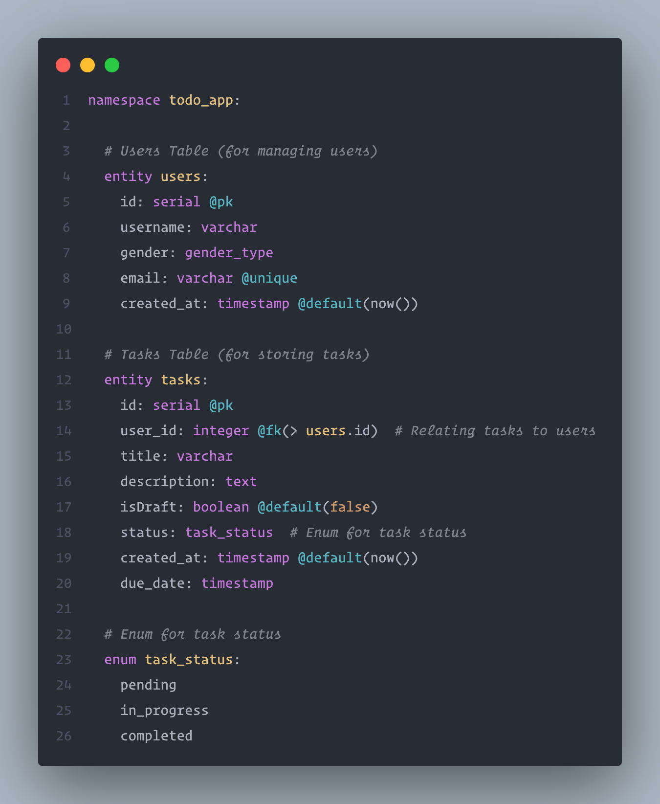

# Yeti

> [!WARNING]
> This project is under active development and is currently in its initial stages.
>
> - **Expect frequent changes:** The API, features, and overall structure may undergo significant modifications.
> - **Potential for bugs:** There may be unexpected bugs or stability issues.
> - **Limited documentation:** Documentation may be incomplete or outdated.
>
> We appreciate your understanding and welcome your feedback as we continue to improve this project.

---

**Yeti** is a lightweight and expressive database markup language designed for intuitive schema and relationship design. Yeti makes it easy to define entities, fields, relationships, and constraints in a concise format.



---

## Features

- **Human-Readable Syntax**: Define schemas in a way that is easy to write and understand.
- **Built-In Constraints**: Specify data types, defaults, constraints, and relationships directly in the schema.
- **Expressive Relationships**: Handle one-to-one, one-to-many, and many-to-many relationships effortlessly.
- **Index Support**: Define indexes on fields to optimize database performance.

---

## Example Schema

```yeti
namespace todo_app:

  # Users Table (for managing users)
  entity users:
    id: serial @pk
    username: varchar
    email: varchar @unique
    created_at: timestamp @default(now())

  # Tasks Table (for storing tasks)
  entity tasks:
    id: serial @pk
    user_id: integer @fk(> users.id)  # Relating tasks to users
    title: varchar
    description: text
    status: task_status  # Enum for task status
    created_at: timestamp @default(now())
    due_date: timestamp

  # Enum for task status
  enum task_status:
    pending
    in_progress
    completed
```

## Contributing

Contributions are welcome! Feel free to submit issues or pull requests to help improve Yeti.

---

## License

Yeti is open-source software licensed under the MIT License.
