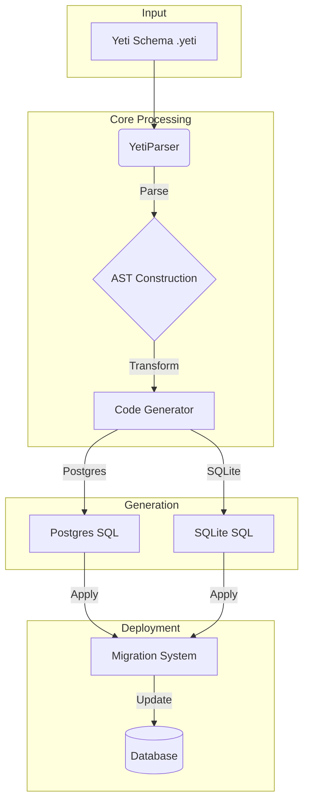

# Yeti

> [!WARNING]
> This project is under active development and still in its early stages.
>
> - **Expect frequent changes:** The API, features, and structure will shift as the project matures.
> - **Bugs are likely:** You may hit unexpected issues or instability.
> - **Documentation is incomplete:** Some docs are missing or behind the code.
>
> Feedback is welcome as work continues.

---

**Yeti** is a lightweight database markup language for defining schemas and relationships. Write your entities, fields, constraints, and relationships in a concise, readable format — Yeti handles the SQL.


---

## Features

- **Readable syntax** — schemas are plain text that reads like what it describes
- **Built-in constraints** — types, defaults, and relationships live in the schema
- **Relationship support** — one-to-one, one-to-many, and many-to-many work out of the box
- **Index definitions** — declare indexes directly on fields
- **Migration management** — a built-in system for tracking and applying schema changes
- **VS Code integration** — syntax highlighting for `.yeti` files

---

## Example Schema

```yeti
namespace todo_app:

  # Users Table (for managing users)
  entity users:
    id: serial @pk
    username: varchar
    email: varchar @unique
    created_at: timestamp @default(now())

  # Tasks Table (for storing tasks)
  entity tasks:
    id: serial @pk
    user_id: integer @fk(> users.id)  # Relating tasks to users
    title: varchar
    description: text
    status: task_status  # Enum for task status
    created_at: timestamp @default(now())
    due_date: timestamp

  # Enum for task status
  enum task_status:
    pending
    in_progress
    completed
```

## Architecture & Workflow

Yeti turns schema files into SQL through three stages: parsing, code generation, and migration.



### 1. Parsing (`@yeti/parse`)

`YetiParser` reads a raw Yeti schema string and builds an AST from it.

- Processes input line by line, stripping comments and using indentation to determine scope
- Uses regex patterns to identify namespaces, entities, enums, and attributes
- Produces a tree of `Namespace` objects, each containing `Entity` and `Enum` definitions with their fields and attributes

### 2. Code Generation (`@yeti/generator`)

The generator walks the AST and produces database-specific SQL.

- `BaseSQLGenerator` provides the core traversal logic as an abstract class
- Concrete implementations like `PostgresGenerator` supply a `SQLDialect` and `TemplateProvider` for database-specific syntax — data types, quoting rules, and so on
- Output covers tables, foreign keys, and indexes as DDL strings

### 3. Migration (`@yeti/migration-core`)

The migration system applies generated SQL to your database in a controlled way.

- `MigrationSystem` tracks which migrations have run and applies them in order
- Database-specific adapters (like `@yeti/sqlite-migration`) handle the actual connection and execution
- Applied history is validated against migration files to catch inconsistencies
- Concurrent runs are protected with `better-lock`

---

## Contributing

Issues and pull requests are welcome.

---

## License

MIT
